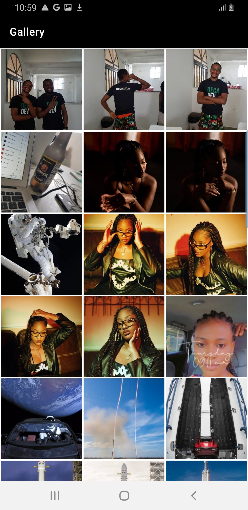
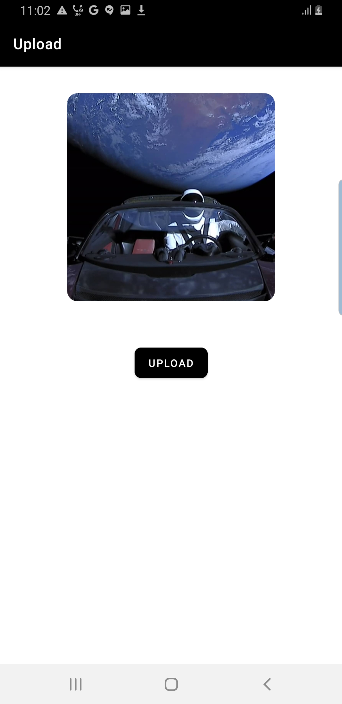

# upload
I demonstrate a simple use-case of the Media Store for querying and displaying images on a user's android device.
If an image is selected, users can click the upload button to post to the server

# screenshots
|          |            |            |
|-------------------------------------------|-------------------------------------------|-------------------------------------------|
